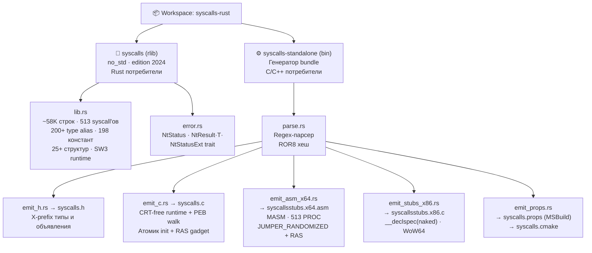
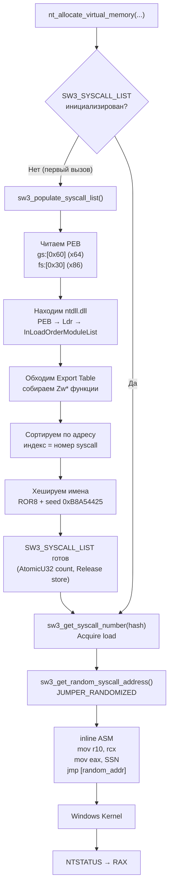
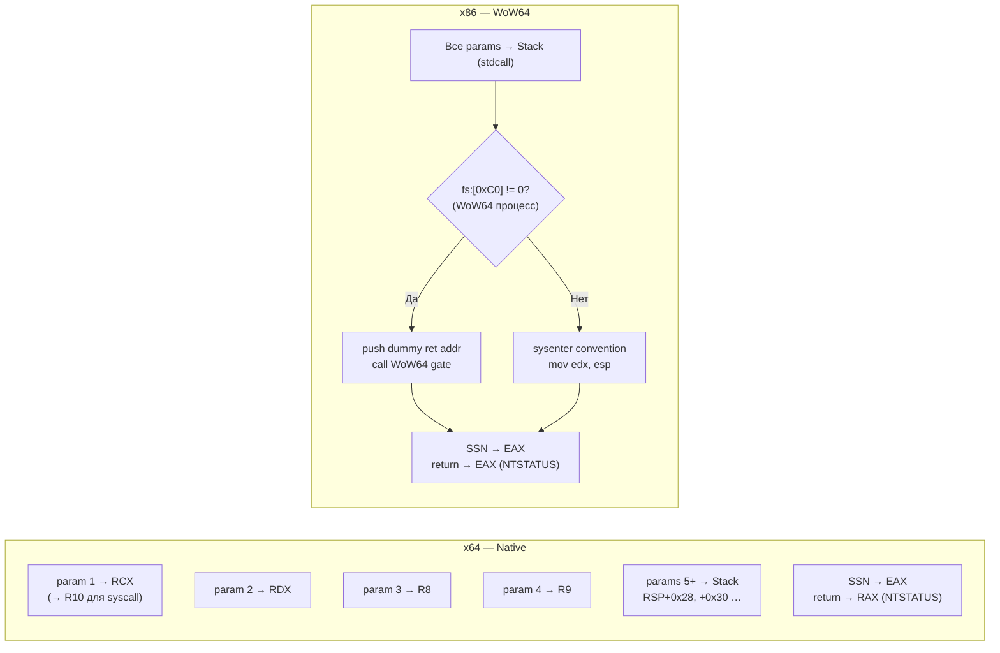

# syscalls-rust

[](LICENSE)
[](https://www.rust-lang.org)
[](https://doc.rust-lang.org/edition-guide/rust-2024/)
[]()

**[🇬🇧 English version](README.md)**

Библиотека прямых Windows NT syscall'ов для Rust — 513 функций, без линковки
с `ntdll`, полная поддержка WoW64, хеш-обфускация имён, JUMPER_RANDOMIZED +
Return-Address Spoofing. Включает генератор self-contained C/H/MASM drop-in
bundle для не-Rust потребителей.

> ⚠️ **Security Notice**: Предназначена для security research, red team операций
> и легитимного security testing. Неправомерное использование может нарушать
> законодательство.

---

## Возможности

- **513 NT syscall'ов** — полная поверхность Windows NT (`Nt*` / `Zw*`)
- **Без линковки с `ntdll`** — номера syscall'ов определяются в runtime через PEB walk
- **Хеш-обфускация** — ROR8 + seed `0xB8A54425`; имён функций нет в бинарнике
- **JUMPER_RANDOMIZED** — прыжок на случайный `syscall; ret` слайд в ntdll, подмена return address
- **Return-Address Spoofing (RAS)** — на x64 в генерируемом bundle
- **Поддержка WoW64** — все 513 стабов имеют x86 вариант с runtime-определением WoW64 gate
- **`#![no_std]`** — нулевые runtime-зависимости (под `cfg_attr(not(test), ...)`)
- **Stable Rust** — `naked_asm!` и `#[unsafe(naked)]` стабильны с 1.85; nightly не нужен
- **Standalone bundle** — `cargo run -p syscalls-standalone -- --out <dir>` генерирует drop-in C/H/MASM

---

## Архитектура

### Структура workspace



### Поток выполнения syscall



### Соглашения о вызовах



---

## Быстрый старт

### Зависимость

```toml
[dependencies]
syscalls = { path = "path/to/syscalls-rust" }
```

Требуется **MSVC toolchain** (`x86_64-pc-windows-msvc` или `i686-pc-windows-msvc`).
Nightly не нужен — достаточно stable Rust 1.98+.

### Базовый пример — аллокация памяти

```rust
use syscalls::*;

unsafe {
    let mut base: PVOID = core::ptr::null_mut();
    let mut size: SIZE_T = 0x1000;

    let status = nt_allocate_virtual_memory(
        NtCurrentProcess(),
        &mut base,
        0,
        &mut size,
        MEM_COMMIT | MEM_RESERVE,
        PAGE_READWRITE,
    );

    if NT_SUCCESS(status) {
        // ... используем память ...

        let mut free_size: SIZE_T = 0;
        nt_free_virtual_memory(NtCurrentProcess(), &mut base, &mut free_size, MEM_RELEASE);
    }
}
```

### Обработка ошибок через `NtStatus`

```rust
use syscalls::{NtStatus, NtStatusExt, *};

unsafe {
    let raw = nt_open_process(/* ... */);

    // Вариант 1 — макрос
    if NT_SUCCESS(raw) { /* ok */ }

    // Вариант 2 — типизированная обёртка
    let status = NtStatus::from(raw);
    println!("{}", status); // например "STATUS_ACCESS_DENIED"

    // Вариант 3 — Result
    raw.to_result()?; // возвращает Err(NtStatus) при ошибке
}
```

---

## Standalone C/H/MASM Bundle

Для C/C++ проектов без зависимости от Rust:

```bash
cargo run -p syscalls-standalone -- --out D:\path\to\output
```

Генерирует self-contained drop-in (Rust runtime не нужен):

| Файл | Описание |
|------|----------|
| `syscalls.h` | X-prefix типы + 513 объявлений функций + макросы |
| `syscalls.c` | CRT-free runtime: PEB walk, атомик init, RAS gadget setup |
| `syscallsstubs.x64.asm` | MASM — 513 PROC стабов с JUMPER_RANDOMIZED + RAS |
| `syscallsstubs.x86.c` | `__declspec(naked)` стабы с WoW64 gate detection |
| `syscalls.props` | MSBuild property sheet (интеграция в `.vcxproj`) |
| `syscalls.cmake` | CMake интеграция (`xsyscalls_attach(target)`) |

Все символы имеют `X`-префикс (`XNtAllocateVirtualMemory`, `X_HANDLE`, …) —
не конфликтует с `<windows.h>`.

---

## Сборка

### Targets

```bash
# x64 native
cargo build --release --target x86_64-pc-windows-msvc

# x86 / WoW64
cargo build --release --target i686-pc-windows-msvc

# Оба (workspace)
cargo build --workspace --release
```

### Features

| Feature | Описание |
|---------|----------|
| `debug` | Вставляет `int3` перед каждым syscall (для отладчика) |

```toml
syscalls = { path = "…", features = ["debug"] }
```

### Release-профиль

| Параметр | Значение | Причина |
|----------|----------|---------|
| `opt-level` | `"z"` | Минимизация размера бинарника |
| `lto` | `true` | Cross-crate inlining |
| `codegen-units` | `1` | Лучшая оптимизация |
| `panic` | `"abort"` | Без unwinding, без CRT |
| `strip` | `true` | Удаление debug символов |

---

## Конфигурация

| Параметр | Значение | Описание |
|----------|----------|----------|
| **Seed** | `0xB8A54425` | Compile-time ROR8 хеш seed — **не менять** без пересчёта всех хешей |
| **Архитектура** | `x86_64 + x86` | Host-native x64 и WoW64 x86 |
| **Recovery** | `JUMPER_RANDOMIZED` | Случайный `syscall; ret` слайд в ntdll |
| **WoW64** | все 513 стабов | Runtime-определение gate через `fs:[0xC0]` |
| **Функций** | 513 | Полная `Nt*` поверхность |

---

## Справочник функций

### Сводная таблица

| Категория | Количество | Примеры |
|-----------|-----------|---------|
| Memory | 12 | `NtAllocateVirtualMemory`, `NtProtectVirtualMemory`, `NtQueryVirtualMemory` |
| Process | 32 | `NtCreateProcess`, `NtOpenProcess`, `NtTerminateProcess` |
| Thread | 33 | `NtCreateThread`, `NtSuspendThread`, `NtGetContextThread` |
| File / IO | 163 | `NtCreateFile`, `NtReadFile`, `NtWriteFile`, `NtDeviceIoControlFile` |
| Registry | 49 | `NtCreateKey`, `NtOpenKey`, `NtSetValueKey`, `NtQueryValueKey` |
| Token | 21 | `NtOpenProcessToken`, `NtAdjustPrivilegesToken`, `NtDuplicateToken` |
| Synchronization | 45 | `NtCreateEvent`, `NtWaitForSingleObject`, `NtCreateMutant` |
| Object | 22 | `NtClose`, `NtDuplicateObject`, `NtQueryObject` |
| System | 9 | `NtQuerySystemInformation`, `NtQuerySystemTime` |
| Other | 127 | ALPC, atoms, audit, debug, power, enclave, … |
| **Итого** | **513** | |

### Memory (12)

| NT Функция | Rust Функция |
|------------|--------------|
| `NtAllocateVirtualMemory` | `nt_allocate_virtual_memory` |
| `NtAllocateVirtualMemoryEx` | `nt_allocate_virtual_memory_ex` |
| `NtFlushVirtualMemory` | `nt_flush_virtual_memory` |
| `NtFreeVirtualMemory` | `nt_free_virtual_memory` |
| `NtLockVirtualMemory` | `nt_lock_virtual_memory` |
| `NtProtectVirtualMemory` | `nt_protect_virtual_memory` |
| `NtQueryVirtualMemory` | `nt_query_virtual_memory` |
| `NtReadVirtualMemory` | `nt_read_virtual_memory` |
| `NtReadVirtualMemoryEx` | `nt_read_virtual_memory_ex` |
| `NtSetInformationVirtualMemory` | `nt_set_information_virtual_memory` |
| `NtUnlockVirtualMemory` | `nt_unlock_virtual_memory` |
| `NtWriteVirtualMemory` | `nt_write_virtual_memory` |

### Process (32)

| NT Функция | Rust Функция |
|------------|--------------|
| `NtAcquireProcessActivityReference` | `nt_acquire_process_activity_reference` |
| `NtAlpcOpenSenderProcess` | `nt_alpc_open_sender_process` |
| `NtAssignProcessToJobObject` | `nt_assign_process_to_job_object` |
| `NtAssignProcessToSiloObject` | `nt_assign_process_to_silo_object` |
| `NtChangeProcessState` | `nt_change_process_state` |
| `NtCreateJobObject` | `nt_create_job_object` |
| `NtCreateJobSet` | `nt_create_job_set` |
| `NtCreateProcess` | `nt_create_process` |
| `NtCreateProcessEx` | `nt_create_process_ex` |
| `NtCreateProcessStateChange` | `nt_create_process_state_change` |
| `NtCreateUserProcess` | `nt_create_user_process` |
| `NtDebugActiveProcess` | `nt_debug_active_process` |
| `NtFlushProcessWriteBuffers` | `nt_flush_process_write_buffers` |
| `NtGetCurrentProcessorNumber` | `nt_get_current_processor_number` |
| `NtGetCurrentProcessorNumberEx` | `nt_get_current_processor_number_ex` |
| `NtGetNextProcess` | `nt_get_next_process` |
| `NtIsProcessInJob` | `nt_is_process_in_job` |
| `NtOpenJobObject` | `nt_open_job_object` |
| `NtOpenProcess` | `nt_open_process` |
| `NtOpenProcessToken` | `nt_open_process_token` |
| `NtOpenProcessTokenEx` | `nt_open_process_token_ex` |
| `NtQueryInformationJobObject` | `nt_query_information_job_object` |
| `NtQueryInformationProcess` | `nt_query_information_process` |
| `NtQueryPortInformationProcess` | `nt_query_port_information_process` |
| `NtRemoveProcessDebug` | `nt_remove_process_debug` |
| `NtResumeProcess` | `nt_resume_process` |
| `NtSetInformationJobObject` | `nt_set_information_job_object` |
| `NtSetInformationProcess` | `nt_set_information_process` |
| `NtSetWnfProcessNotificationEvent` | `nt_set_wnf_process_notification_event` |
| `NtSuspendProcess` | `nt_suspend_process` |
| `NtTerminateJobObject` | `nt_terminate_job_object` |
| `NtTerminateProcess` | `nt_terminate_process` |

### Thread (33)

| NT Функция | Rust Функция |
|------------|--------------|
| `NtAlertMultipleThreadByThreadId` | `nt_alert_multiple_thread_by_thread_id` |
| `NtAlertResumeThread` | `nt_alert_resume_thread` |
| `NtAlertThread` | `nt_alert_thread` |
| `NtAlertThreadByThreadId` | `nt_alert_thread_by_thread_id` |
| `NtAlertThreadByThreadIdEx` | `nt_alert_thread_by_thread_id_ex` |
| `NtAlpcCreateSecurityContext` | `nt_alpc_create_security_context` |
| `NtAlpcDeleteSecurityContext` | `nt_alpc_delete_security_context` |
| `NtAlpcOpenSenderThread` | `nt_alpc_open_sender_thread` |
| `NtAlpcRevokeSecurityContext` | `nt_alpc_revoke_security_context` |
| `NtChangeThreadState` | `nt_change_thread_state` |
| `NtCreateThread` | `nt_create_thread` |
| `NtCreateThreadEx` | `nt_create_thread_ex` |
| `NtCreateThreadStateChange` | `nt_create_thread_state_change` |
| `NtGetContextThread` | `nt_get_context_thread` |
| `NtGetNextThread` | `nt_get_next_thread` |
| `NtImpersonateThread` | `nt_impersonate_thread` |
| `NtMapCMFModule` | `nt_map_cmf_module` |
| `NtOpenThread` | `nt_open_thread` |
| `NtOpenThreadToken` | `nt_open_thread_token` |
| `NtOpenThreadTokenEx` | `nt_open_thread_token_ex` |
| `NtQueryInformationThread` | `nt_query_information_thread` |
| `NtQueueApcThread` | `nt_queue_apc_thread` |
| `NtQueueApcThreadEx` | `nt_queue_apc_thread_ex` |
| `NtQueueApcThreadEx2` | `nt_queue_apc_thread_ex2` |
| `NtRegisterThreadTerminatePort` | `nt_register_thread_terminate_port` |
| `NtResumeThread` | `nt_resume_thread` |
| `NtSetContextThread` | `nt_set_context_thread` |
| `NtSetInformationThread` | `nt_set_information_thread` |
| `NtSetThreadExecutionState` | `nt_set_thread_execution_state` |
| `NtSuspendThread` | `nt_suspend_thread` |
| `NtTerminateThread` | `nt_terminate_thread` |
| `NtUmsThreadYield` | `nt_ums_thread_yield` |
| `NtWaitForAlertByThreadId` | `nt_wait_for_alert_by_thread_id` |

### File / IO (163)

| NT Функция | Rust Функция |
|------------|--------------|
| `NtAlpcCreatePortSection` | `nt_alpc_create_port_section` |
| `NtAlpcCreateSectionView` | `nt_alpc_create_section_view` |
| `NtAlpcDeletePortSection` | `nt_alpc_delete_port_section` |
| `NtAlpcDeleteSectionView` | `nt_alpc_delete_section_view` |
| `NtAlpcQueryInformation` | `nt_alpc_query_information` |
| `NtAlpcQueryInformationMessage` | `nt_alpc_query_information_message` |
| `NtAlpcSetInformation` | `nt_alpc_set_information` |
| `NtAreMappedFilesTheSame` | `nt_are_mapped_files_the_same` |
| `NtAssociateWaitCompletionPacket` | `nt_associate_wait_completion_packet` |
| `NtCancelIoFile` | `nt_cancel_io_file` |
| `NtCancelIoFileEx` | `nt_cancel_io_file_ex` |
| `NtCancelSynchronousIoFile` | `nt_cancel_synchronous_io_file` |
| `NtCancelWaitCompletionPacket` | `nt_cancel_wait_completion_packet` |
| `NtClearAllSavepointsTransaction` | `nt_clear_all_savepoints_transaction` |
| `NtClearSavepointTransaction` | `nt_clear_savepoint_transaction` |
| `NtCommitRegistryTransaction` | `nt_commit_registry_transaction` |
| `NtCommitTransaction` | `nt_commit_transaction` |
| `NtCopyFileChunk` | `nt_copy_file_chunk` |
| `NtCreateCpuPartition` | `nt_create_cpu_partition` |
| `NtCreateDirectoryObject` | `nt_create_directory_object` |
| `NtCreateDirectoryObjectEx` | `nt_create_directory_object_ex` |
| `NtCreateFile` | `nt_create_file` |
| `NtCreateIoCompletion` | `nt_create_io_completion` |
| `NtCreateIoRing` | `nt_create_io_ring` |
| `NtCreateMailslotFile` | `nt_create_mailslot_file` |
| `NtCreateNamedPipeFile` | `nt_create_named_pipe_file` |
| `NtCreatePagingFile` | `nt_create_paging_file` |
| `NtCreatePartition` | `nt_create_partition` |
| `NtCreateProfile` | `nt_create_profile` |
| `NtCreateProfileEx` | `nt_create_profile_ex` |
| `NtCreateRegistryTransaction` | `nt_create_registry_transaction` |
| `NtCreateSection` | `nt_create_section` |
| `NtCreateSectionEx` | `nt_create_section_ex` |
| `NtCreateTransaction` | `nt_create_transaction` |
| `NtCreateTransactionManager` | `nt_create_transaction_manager` |
| `NtCreateWaitCompletionPacket` | `nt_create_wait_completion_packet` |
| `NtCreateWnfStateName` | `nt_create_wnf_state_name` |
| `NtDelayExecution` | `nt_delay_execution` |
| `NtDeleteFile` | `nt_delete_file` |
| `NtDeleteWnfStateData` | `nt_delete_wnf_state_data` |
| `NtDeleteWnfStateName` | `nt_delete_wnf_state_name` |
| `NtDeviceIoControlFile` | `nt_device_io_control_file` |
| `NtEnumerateTransactionObject` | `nt_enumerate_transaction_object` |
| `NtExtendSection` | `nt_extend_section` |
| `NtFilterBootOption` | `nt_filter_boot_option` |
| `NtFlushBuffersFile` | `nt_flush_buffers_file` |
| `NtFlushBuffersFileEx` | `nt_flush_buffers_file_ex` |
| `NtFlushInstructionCache` | `nt_flush_instruction_cache` |
| `NtFreezeTransactions` | `nt_freeze_transactions` |
| `NtFsControlFile` | `nt_fs_control_file` |
| `NtGetCompleteWnfStateSubscription` | `nt_get_complete_wnf_state_subscription` |
| `NtGetNlsSectionPtr` | `nt_get_nls_section_ptr` |
| `NtGetNotificationResourceManager` | `nt_get_notification_resource_manager` |
| `NtInitializeNlsFiles` | `nt_initialize_nls_files` |
| `NtInitiatePowerAction` | `nt_initiate_power_action` |
| `NtListTransactions` | `nt_list_transactions` |
| `NtLockFile` | `nt_lock_file` |
| `NtLockProductActivationKeys` | `nt_lock_product_activation_keys` |
| `NtManagePartition` | `nt_manage_partition` |
| `NtMapViewOfSection` | `nt_map_view_of_section` |
| `NtMapViewOfSectionEx` | `nt_map_view_of_section_ex` |
| `NtMarshallTransaction` | `nt_marshall_transaction` |
| `NtNotifyChangeDirectoryFile` | `nt_notify_change_directory_file` |
| `NtNotifyChangeDirectoryFileEx` | `nt_notify_change_directory_file_ex` |
| `NtNotifyChangeSession` | `nt_notify_change_session` |
| `NtOpenCpuPartition` | `nt_open_cpu_partition` |
| `NtOpenDirectoryObject` | `nt_open_directory_object` |
| `NtOpenFile` | `nt_open_file` |
| `NtOpenIoCompletion` | `nt_open_io_completion` |
| `NtOpenPartition` | `nt_open_partition` |
| `NtOpenRegistryTransaction` | `nt_open_registry_transaction` |
| `NtOpenSection` | `nt_open_section` |
| `NtOpenSession` | `nt_open_session` |
| `NtOpenTransaction` | `nt_open_transaction` |
| `NtOpenTransactionManager` | `nt_open_transaction_manager` |
| `NtPowerInformation` | `nt_power_information` |
| `NtPropagationComplete` | `nt_propagation_complete` |
| `NtPropagationFailed` | `nt_propagation_failed` |
| `NtPullTransaction` | `nt_pull_transaction` |
| `NtQueryAttributesFile` | `nt_query_attributes_file` |
| `NtQueryBootOptions` | `nt_query_boot_options` |
| `NtQueryDirectoryFile` | `nt_query_directory_file` |
| `NtQueryDirectoryFileEx` | `nt_query_directory_file_ex` |
| `NtQueryDirectoryObject` | `nt_query_directory_object` |
| `NtQueryEaFile` | `nt_query_ea_file` |
| `NtQueryFullAttributesFile` | `nt_query_full_attributes_file` |
| `NtQueryInformationAtom` | `nt_query_information_atom` |
| `NtQueryInformationByName` | `nt_query_information_by_name` |
| `NtQueryInformationCpuPartition` | `nt_query_information_cpu_partition` |
| `NtQueryInformationEnlistment` | `nt_query_information_enlistment` |
| `NtQueryInformationFile` | `nt_query_information_file` |
| `NtQueryInformationPort` | `nt_query_information_port` |
| `NtQueryInformationResourceManager` | `nt_query_information_resource_manager` |
| `NtQueryInformationSiloObject` | `nt_query_information_silo_object` |
| `NtQueryInformationToken` | `nt_query_information_token` |
| `NtQueryInformationTransaction` | `nt_query_information_transaction` |
| `NtQueryInformationTransactionManager` | `nt_query_information_transaction_manager` |
| `NtQueryInformationWorkerFactory` | `nt_query_information_worker_factory` |
| `NtQueryIntervalProfile` | `nt_query_interval_profile` |
| `NtQueryIoCompletion` | `nt_query_io_completion` |
| `NtQueryIoRingCapabilities` | `nt_query_io_ring_capabilities` |
| `NtQueryQuotaInformationFile` | `nt_query_quota_information_file` |
| `NtQuerySection` | `nt_query_section` |
| `NtQuerySystemInformation` | `nt_query_system_information` |
| `NtQuerySystemInformationEx` | `nt_query_system_information_ex` |
| `NtQueryTimerResolution` | `nt_query_timer_resolution` |
| `NtQueryVolumeInformationFile` | `nt_query_volume_information_file` |
| `NtQueryWnfStateData` | `nt_query_wnf_state_data` |
| `NtQueryWnfStateNameInformation` | `nt_query_wnf_state_name_information` |
| `NtRaiseException` | `nt_raise_exception` |
| `NtReadFile` | `nt_read_file` |
| `NtReadFileScatter` | `nt_read_file_scatter` |
| `NtRecoverTransactionManager` | `nt_recover_transaction_manager` |
| `NtRegisterProtocolAddressInformation` | `nt_register_protocol_address_information` |
| `NtRemoveIoCompletion` | `nt_remove_io_completion` |
| `NtRemoveIoCompletionEx` | `nt_remove_io_completion_ex` |
| `NtRenameTransactionManager` | `nt_rename_transaction_manager` |
| `NtReplacePartitionUnit` | `nt_replace_partition_unit` |
| `NtRevertContainerImpersonation` | `nt_revert_container_impersonation` |
| `NtRollbackRegistryTransaction` | `nt_rollback_registry_transaction` |
| `NtRollbackSavepointTransaction` | `nt_rollback_savepoint_transaction` |
| `NtRollbackTransaction` | `nt_rollback_transaction` |
| `NtRollforwardTransactionManager` | `nt_rollforward_transaction_manager` |
| `NtSavepointTransaction` | `nt_savepoint_transaction` |
| `NtSetBootOptions` | `nt_set_boot_options` |
| `NtSetEaFile` | `nt_set_ea_file` |
| `NtSetEventBoostPriority` | `nt_set_event_boost_priority` |
| `NtSetInformationCpuPartition` | `nt_set_information_cpu_partition` |
| `NtSetInformationDebugObject` | `nt_set_information_debug_object` |
| `NtSetInformationEnlistment` | `nt_set_information_enlistment` |
| `NtSetInformationFile` | `nt_set_information_file` |
| `NtSetInformationIoRing` | `nt_set_information_io_ring` |
| `NtSetInformationKey` | `nt_set_information_key` |
| `NtSetInformationObject` | `nt_set_information_object` |
| `NtSetInformationResourceManager` | `nt_set_information_resource_manager` |
| `NtSetInformationSiloObject` | `nt_set_information_silo_object` |
| `NtSetInformationSymbolicLink` | `nt_set_information_symbolic_link` |
| `NtSetInformationToken` | `nt_set_information_token` |
| `NtSetInformationTransaction` | `nt_set_information_transaction` |
| `NtSetInformationTransactionManager` | `nt_set_information_transaction_manager` |
| `NtSetInformationWorkerFactory` | `nt_set_information_worker_factory` |
| `NtSetIntervalProfile` | `nt_set_interval_profile` |
| `NtSetIoCompletion` | `nt_set_io_completion` |
| `NtSetIoCompletionEx` | `nt_set_io_completion_ex` |
| `NtSetQuotaInformationFile` | `nt_set_quota_information_file` |
| `NtSetSystemInformation` | `nt_set_system_information` |
| `NtSetTimerResolution` | `nt_set_timer_resolution` |
| `NtSetVolumeInformationFile` | `nt_set_volume_information_file` |
| `NtStartProfile` | `nt_start_profile` |
| `NtStopProfile` | `nt_stop_profile` |
| `NtSubmitIoRing` | `nt_submit_io_ring` |
| `NtSubscribeWnfStateChange` | `nt_subscribe_wnf_state_change` |
| `NtThawTransactions` | `nt_thaw_transactions` |
| `NtTranslateFilePath` | `nt_translate_file_path` |
| `NtUnlockFile` | `nt_unlock_file` |
| `NtUnmapViewOfSection` | `nt_unmap_view_of_section` |
| `NtUnmapViewOfSectionEx` | `nt_unmap_view_of_section_ex` |
| `NtUnsubscribeWnfStateChange` | `nt_unsubscribe_wnf_state_change` |
| `NtUpdateWnfStateData` | `nt_update_wnf_state_data` |
| `NtWaitForWnfNotifications` | `nt_wait_for_wnf_notifications` |
| `NtWriteFile` | `nt_write_file` |
| `NtWriteFileGather` | `nt_write_file_gather` |
| `NtYieldExecution` | `nt_yield_execution` |

### Registry (49)

| NT Функция | Rust Функция |
|------------|--------------|
| `NtCompactKeys` | `nt_compact_keys` |
| `NtCompressKey` | `nt_compress_key` |
| `NtCreateKey` | `nt_create_key` |
| `NtCreateKeyTransacted` | `nt_create_key_transacted` |
| `NtCreateKeyedEvent` | `nt_create_keyed_event` |
| `NtDeleteKey` | `nt_delete_key` |
| `NtDeleteValueKey` | `nt_delete_value_key` |
| `NtEnumerateKey` | `nt_enumerate_key` |
| `NtEnumerateSystemEnvironmentValuesEx` | `nt_enumerate_system_environment_values_ex` |
| `NtEnumerateValueKey` | `nt_enumerate_value_key` |
| `NtFlushKey` | `nt_flush_key` |
| `NtFreezeRegistry` | `nt_freeze_registry` |
| `NtGetMUIRegistryInfo` | `nt_get_mui_registry_info` |
| `NtInitializeRegistry` | `nt_initialize_registry` |
| `NtLoadKey` | `nt_load_key` |
| `NtLoadKey2` | `nt_load_key2` |
| `NtLoadKey3` | `nt_load_key3` |
| `NtLoadKeyEx` | `nt_load_key_ex` |
| `NtLockRegistryKey` | `nt_lock_registry_key` |
| `NtNotifyChangeKey` | `nt_notify_change_key` |
| `NtNotifyChangeMultipleKeys` | `nt_notify_change_multiple_keys` |
| `NtOpenKey` | `nt_open_key` |
| `NtOpenKeyEx` | `nt_open_key_ex` |
| `NtOpenKeyTransacted` | `nt_open_key_transacted` |
| `NtOpenKeyTransactedEx` | `nt_open_key_transacted_ex` |
| `NtOpenKeyedEvent` | `nt_open_keyed_event` |
| `NtQueryKey` | `nt_query_key` |
| `NtQueryLicenseValue` | `nt_query_license_value` |
| `NtQueryMultipleValueKey` | `nt_query_multiple_value_key` |
| `NtQueryOpenSubKeys` | `nt_query_open_sub_keys` |
| `NtQueryOpenSubKeysEx` | `nt_query_open_sub_keys_ex` |
| `NtQuerySystemEnvironmentValue` | `nt_query_system_environment_value` |
| `NtQuerySystemEnvironmentValueEx` | `nt_query_system_environment_value_ex` |
| `NtQueryValueKey` | `nt_query_value_key` |
| `NtReleaseKeyedEvent` | `nt_release_keyed_event` |
| `NtRenameKey` | `nt_rename_key` |
| `NtReplaceKey` | `nt_replace_key` |
| `NtRestoreKey` | `nt_restore_key` |
| `NtSaveKey` | `nt_save_key` |
| `NtSaveKeyEx` | `nt_save_key_ex` |
| `NtSaveMergedKeys` | `nt_save_merged_keys` |
| `NtSetSystemEnvironmentValue` | `nt_set_system_environment_value` |
| `NtSetSystemEnvironmentValueEx` | `nt_set_system_environment_value_ex` |
| `NtSetValueKey` | `nt_set_value_key` |
| `NtThawRegistry` | `nt_thaw_registry` |
| `NtUnloadKey` | `nt_unload_key` |
| `NtUnloadKey2` | `nt_unload_key2` |
| `NtUnloadKeyEx` | `nt_unload_key_ex` |
| `NtWaitForKeyedEvent` | `nt_wait_for_keyed_event` |

### Token (21)

| NT Функция | Rust Функция |
|------------|--------------|
| `NtAdjustGroupsToken` | `nt_adjust_groups_token` |
| `NtAdjustPrivilegesToken` | `nt_adjust_privileges_token` |
| `NtAdjustTokenClaimsAndDeviceGroups` | `nt_adjust_token_claims_and_device_groups` |
| `NtAlpcImpersonateClientContainerOfPort` | `nt_alpc_impersonate_client_container_of_port` |
| `NtAlpcImpersonateClientOfPort` | `nt_alpc_impersonate_client_of_port` |
| `NtCompareTokens` | `nt_compare_tokens` |
| `NtCreateLowBoxToken` | `nt_create_low_box_token` |
| `NtCreateToken` | `nt_create_token` |
| `NtCreateTokenEx` | `nt_create_token_ex` |
| `NtDuplicateToken` | `nt_duplicate_token` |
| `NtFilterToken` | `nt_filter_token` |
| `NtFilterTokenEx` | `nt_filter_token_ex` |
| `NtImpersonateAnonymousToken` | `nt_impersonate_anonymous_token` |
| `NtImpersonateClientOfPort` | `nt_impersonate_client_of_port` |
| `NtPrivilegeCheck` | `nt_privilege_check` |
| `NtPrivilegeObjectAuditAlarm` | `nt_privilege_object_audit_alarm` |
| `NtPrivilegedServiceAuditAlarm` | `nt_privileged_service_audit_alarm` |
| `NtQuerySecurityAttributesToken` | `nt_query_security_attributes_token` |
| `NtQuerySecurityObject` | `nt_query_security_object` |
| `NtQuerySecurityPolicy` | `nt_query_security_policy` |
| `NtSetSecurityObject` | `nt_set_security_object` |

### Synchronization (45)

| NT Функция | Rust Функция |
|------------|--------------|
| `NtAcquireCrossVmMutant` | `nt_acquire_cross_vm_mutant` |
| `NtAlpcSendWaitReceivePort` | `nt_alpc_send_wait_receive_port` |
| `NtCancelTimer` | `nt_cancel_timer` |
| `NtCancelTimer2` | `nt_cancel_timer2` |
| `NtClearEvent` | `nt_clear_event` |
| `NtCreateCrossVmEvent` | `nt_create_cross_vm_event` |
| `NtCreateCrossVmMutant` | `nt_create_cross_vm_mutant` |
| `NtCreateEvent` | `nt_create_event` |
| `NtCreateEventPair` | `nt_create_event_pair` |
| `NtCreateIRTimer` | `nt_create_ir_timer` |
| `NtCreateMutant` | `nt_create_mutant` |
| `NtCreateTimer` | `nt_create_timer` |
| `NtCreateTimer2` | `nt_create_timer2` |
| `NtCreateWaitablePort` | `nt_create_waitable_port` |
| `NtGetPlugPlayEvent` | `nt_get_plug_play_event` |
| `NtOpenEvent` | `nt_open_event` |
| `NtOpenEventPair` | `nt_open_event_pair` |
| `NtOpenMutant` | `nt_open_mutant` |
| `NtOpenTimer` | `nt_open_timer` |
| `NtPulseEvent` | `nt_pulse_event` |
| `NtQueryEvent` | `nt_query_event` |
| `NtQueryMutant` | `nt_query_mutant` |
| `NtQueryTimer` | `nt_query_timer` |
| `NtReleaseMutant` | `nt_release_mutant` |
| `NtReplyWaitReceivePort` | `nt_reply_wait_receive_port` |
| `NtReplyWaitReceivePortEx` | `nt_reply_wait_receive_port_ex` |
| `NtReplyWaitReplyPort` | `nt_reply_wait_reply_port` |
| `NtRequestWaitReplyPort` | `nt_request_wait_reply_port` |
| `NtResetEvent` | `nt_reset_event` |
| `NtSetEvent` | `nt_set_event` |
| `NtSetEventEx` | `nt_set_event_ex` |
| `NtSetHighEventPair` | `nt_set_high_event_pair` |
| `NtSetHighWaitLowEventPair` | `nt_set_high_wait_low_event_pair` |
| `NtSetIRTimer` | `nt_set_ir_timer` |
| `NtSetLowEventPair` | `nt_set_low_event_pair` |
| `NtSetLowWaitHighEventPair` | `nt_set_low_wait_high_event_pair` |
| `NtSetTimer` | `nt_set_timer` |
| `NtSetTimer2` | `nt_set_timer2` |
| `NtSetTimerEx` | `nt_set_timer_ex` |
| `NtTestAlert` | `nt_test_alert` |
| `NtTraceEvent` | `nt_trace_event` |
| `NtWaitForDebugEvent` | `nt_wait_for_debug_event` |
| `NtWaitForWorkViaWorkerFactory` | `nt_wait_for_work_via_worker_factory` |
| `NtWaitHighEventPair` | `nt_wait_high_event_pair` |
| `NtWaitLowEventPair` | `nt_wait_low_event_pair` |

### Object (22)

| NT Функция | Rust Функция |
|------------|--------------|
| `NtAccessCheckByTypeResultListAndAuditAlarmByHandle` | `nt_access_check_by_type_result_list_and_audit_alarm_by_handle` |
| `NtAllocateReserveObject` | `nt_allocate_reserve_object` |
| `NtClose` | `nt_close` |
| `NtCloseObjectAuditAlarm` | `nt_close_object_audit_alarm` |
| `NtCompareObjects` | `nt_compare_objects` |
| `NtCreateDebugObject` | `nt_create_debug_object` |
| `NtCreateSiloObject` | `nt_create_silo_object` |
| `NtCreateSymbolicLinkObject` | `nt_create_symbolic_link_object` |
| `NtDeleteObjectAuditAlarm` | `nt_delete_object_audit_alarm` |
| `NtDuplicateObject` | `nt_duplicate_object` |
| `NtMakePermanentObject` | `nt_make_permanent_object` |
| `NtMakeTemporaryObject` | `nt_make_temporary_object` |
| `NtOpenObjectAuditAlarm` | `nt_open_object_audit_alarm` |
| `NtOpenSiloObject` | `nt_open_silo_object` |
| `NtOpenSymbolicLinkObject` | `nt_open_symbolic_link_object` |
| `NtQueryObject` | `nt_query_object` |
| `NtQuerySymbolicLinkObject` | `nt_query_symbolic_link_object` |
| `NtSignalAndWaitForSingleObject` | `nt_signal_and_wait_for_single_object` |
| `NtTerminateSiloObject` | `nt_terminate_silo_object` |
| `NtWaitForMultipleObjects` | `nt_wait_for_multiple_objects` |
| `NtWaitForMultipleObjects32` | `nt_wait_for_multiple_objects32` |
| `NtWaitForSingleObject` | `nt_wait_for_single_object` |

### System (9)

| NT Функция | Rust Функция |
|------------|--------------|
| `NtGetDevicePowerState` | `nt_get_device_power_state` |
| `NtIsSystemResumeAutomatic` | `nt_is_system_resume_automatic` |
| `NtPlugPlayControl` | `nt_plug_play_control` |
| `NtQuerySystemTime` | `nt_query_system_time` |
| `NtSetSystemPowerState` | `nt_set_system_power_state` |
| `NtSetSystemTime` | `nt_set_system_time` |
| `NtShutdownSystem` | `nt_shutdown_system` |
| `NtShutdownWorkerFactory` | `nt_shutdown_worker_factory` |
| `NtSystemDebugControl` | `nt_system_debug_control` |

### Section / Semaphore (8)

| NT Функция | Rust Функция |
|------------|--------------|
| `NtAcquireCMFViewOwnership` | `nt_acquire_cmf_view_ownership` |
| `NtCreateSemaphore` | `nt_create_semaphore` |
| `NtMapUserPhysicalPages` | `nt_map_user_physical_pages` |
| `NtMapUserPhysicalPagesScatter` | `nt_map_user_physical_pages_scatter` |
| `NtOpenSemaphore` | `nt_open_semaphore` |
| `NtQuerySemaphore` | `nt_query_semaphore` |
| `NtReleaseCMFViewOwnership` | `nt_release_cmf_view_ownership` |
| `NtReleaseSemaphore` | `nt_release_semaphore` |

---

## Важные замечания

### Параметры-указатели — IN/OUT

Многие syscall'ы принимают изменяемые указатели, которые являются одновременно входными и выходными:

```rust
// НЕПРАВИЛЬНО — не скомпилируется
let region_size: SIZE_T = 0x1000;
nt_allocate_virtual_memory(..., &region_size, ...);

// ПРАВИЛЬНО
let mut region_size: SIZE_T = 0x1000;
nt_allocate_virtual_memory(..., &mut region_size, ...);
```

### Псевдо-хэндлы

```rust
NtCurrentProcess()  // (HANDLE)-1 — текущий процесс
NtCurrentThread()   // (HANDLE)-2 — текущий поток
```

### Потокобезопасность

`SW3_SYSCALL_LIST` инициализируется лениво при первом вызове. Инициализация
использует `AtomicU32` + `AtomicBool` CAS gate — победитель заполняет таблицу
и публикует `count` с `Release`; проигравшие спинятся на `Acquire` load.
Гонка при инициализации безопасна: все потоки вычисляют один и тот же результат.

### Частые коды NTSTATUS

| Код | Имя |
|-----|-----|
| `0x00000000` | `STATUS_SUCCESS` |
| `0x00000102` | `STATUS_TIMEOUT` |
| `0x80000005` | `STATUS_BUFFER_OVERFLOW` |
| `0xC0000005` | `STATUS_ACCESS_VIOLATION` |
| `0xC0000008` | `STATUS_INVALID_HANDLE` |
| `0xC000000D` | `STATUS_INVALID_PARAMETER` |
| `0xC0000022` | `STATUS_ACCESS_DENIED` |
| `0xC0000034` | `STATUS_OBJECT_NAME_NOT_FOUND` |

---

## Диагностика

### «Syscall not found» (возвращает `0xFFFFFFFF`)

Хеш функции не совпал ни с одним экспортом ntdll. Возможные причины:
- Функция отсутствует в данной версии Windows
- Seed изменён после компиляции (никогда не менять `SW3_SEED = 0xB8A54425`)
- ntdll захучен так, что нарушена таблица экспортов

### `STATUS_ACCESS_VIOLATION` при syscall

Обычно неверные параметры:
- NULL-указатель там, где требуется валидный
- Некорректный handle
- Неверно выровненный или слишком маленький буфер

### Поведение отличается от `ntdll`

Некоторые обёртки `ntdll` выполняют дополнительную валидацию перед системным вызовом.
Прямые syscall'ы её пропускают — это может давать другие коды ошибок.

---

## Лицензия

MIT — см. [LICENSE](LICENSE).

---

*Изначально сгенерирован [SysWhispers3](https://github.com/klezVirus/SysWhispers3),
затем расширен: WoW64, edition 2024, RAS, генератор standalone bundle.*
